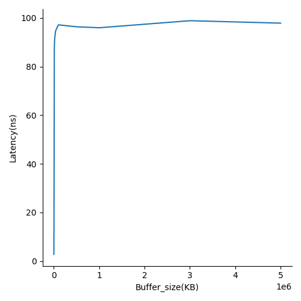
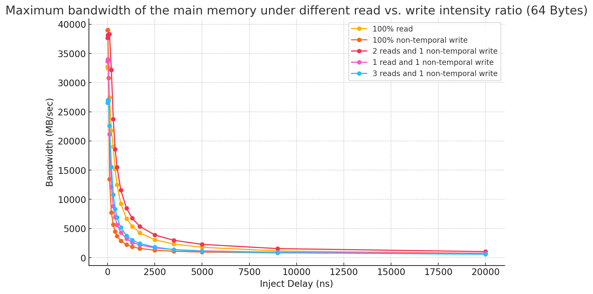
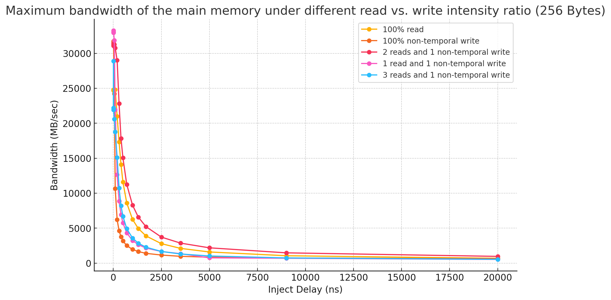
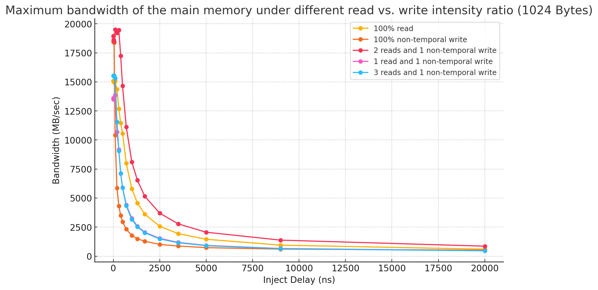
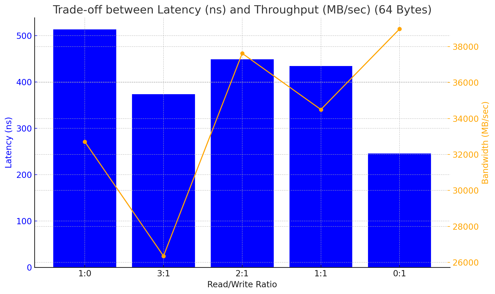
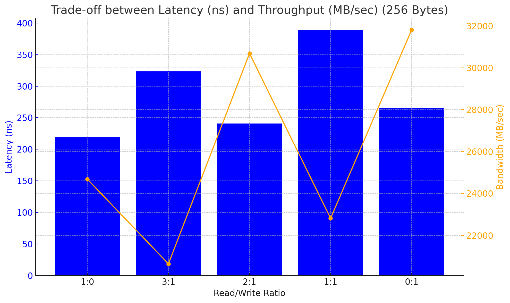
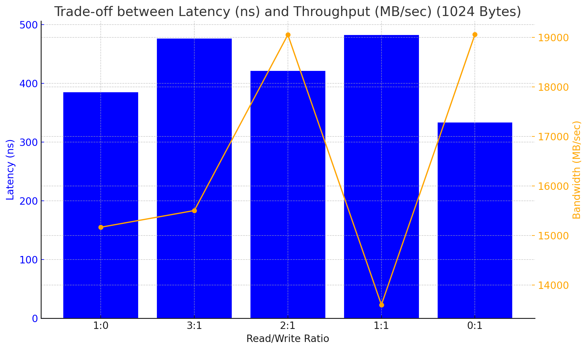
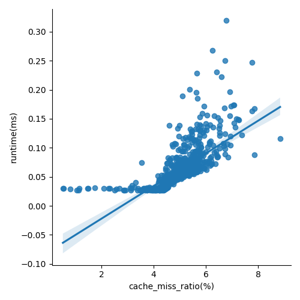
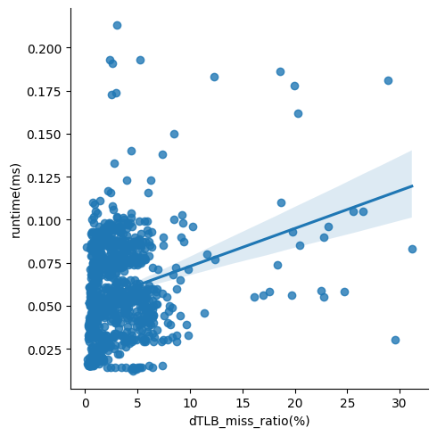

## Read/write Latency of Cache/Main memory
- The `./mlc --idle_latency -b$BUFFER_SIZE can estimate the read latency of zero queue under a particular buffer size.

- The write latency of cache and main memory when the queue length is zero may be similiar with read, and the write operation itself will be a little bit slower.

## Bandwidth vs. granularity
- The maximum bandwidth of the main memory under different data access granularity (i.e., 64B, 256B, 1024B) and different read vs. write intensity ratio (i.e., read-only, write-only, 3:1 ratio, 1:1 ratio)

## Read/Write Latency vs. throughput
- The trade-off between read/write latency and throughput of the main memory to demonstrate what the queuing theory predicts

## The Impact of Cache Miss Ratio
- In this experiment I use run time to measure the speed performance of software.
- The first step is to cause L1 cache miss in the software.
    + Cache miss can be caused by fetch value which is not in L1 cache. Using large arrays may meet the requirement.
    + The next step is randomly read the large array which has larger size than the L1 cache.
    + If the index of the array is random any time, the cache miss would finally happen.
- To make the process intuitive, I directly use the array size increase from `1024*sizeof(int)` to `1024*1024*sizeof(int)`. 
- To make the time calculation easier, I use 1000 multiplication operations as one unit to calculate cache miss and run time calculation. The measure and multiplication process are both in `miss_measure.c`
- I measured 1000 results with increasing array size, the data is in `miss_out.csv`. The plot result is as follow:

- There will be several conclusion considering the figure
  - The result indicates that the cache miss ratio and run time are positively correlated.
  - when cache miss ratio is lower than 4 percent, the run time is influenced more slightly by cache miss. 

## The impact of TLB table miss ratio
- According to the discription above. The measure of TLB miss is similiar. 
- I still use large array to generate dTLB miss.
- The measure and multiplication are both in `miss_measure.c`
- The result data is in `miss_out.csv`, the plot figure is as follow:

- It could be discovered that, the dTLB miss ratio and runtime are positively correlated.

