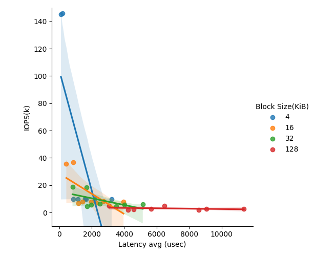
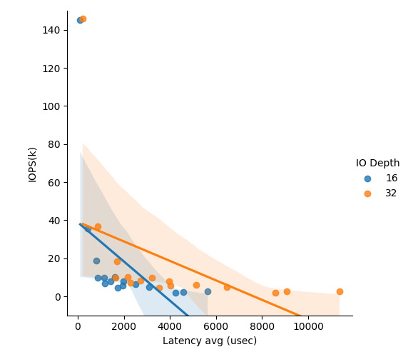
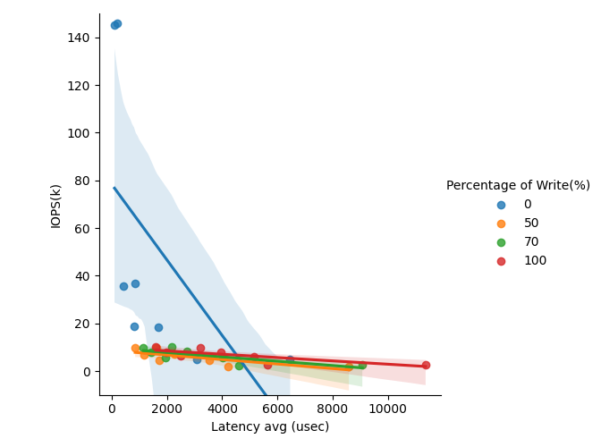

## SSD Performance Profiling
### Instructions
This project helps to gain first-hands experience on profiling the performance of modern SSDs.

FIO is a storage device testing tool widely used in the industry. Like Project 1, we should design a set of experiments to measure the SSD performance (latency and throughput) under different combinations of the following parameters: 

1) data access size (e.g.,4KB/16KB/32KB/128KB)

2) read vs. write intensity ratio (e.g., read-only, write-only, 50%:50% and 70%:30% read vs. write)

3) I/O queue depth (e.g., 0~1024)

### Quick Start
```
sh run.sh
```
### Results
Experimental results using an SSD with a size of 5GB:

[View the CSV file](https://github.com/EricFanexe/ECSE6320/blob/main/Project3/SSD_Performance.csv)

### Figures




### Conclusion
#### Observations
IOPS vs. Block Size: The first graph shows the relationship between IOPS and average latency across different block sizes (4KiB, 16KiB, 32KiB, 128KiB). As block size increases, IOPS generally decreases, and latency increases. Smaller block sizes achieve higher IOPS due to the smaller data size per request, which results in faster processing, but also higher sensitivity to queue depth increases. As expected, larger block sizes suffer from longer latencies due to increased data per access request.

IOPS vs. IO Depth: The second graph highlights the impact of IO depth (16 vs. 32) on IOPS and latency. As IO depth increases, there is a clear increase in throughput (IOPS), but at the cost of higher latency. This matches our expectations from queueing theory: deeper queues allow more operations to be processed in parallel, increasing utilization, but the waiting time for each individual request increases, leading to longer latencies. The results reflect how SSDs balance the trade-off between resource utilization and data access times.

IOPS vs. Percentage of Write: The third graph examines the impact of different write percentages (0%, 50%, 70%, 100%) on IOPS and latency. A higher percentage of writes leads to lower IOPS and higher latencies. This is particularly evident in write-heavy workloads, where the IOPS drop significantly compared to read-heavy scenarios. The results highlight the performance degradation under write-intensive conditions, as SSDs handle reads more efficiently than writes due to the nature of flash memory.

#### Comparison with Intel Enterprise SSD
The Intel Data Center NVMe SSD D7-P5600 (1.6TB) specifies a random 4KB write-only IOPS of 130K. Surprisingly, in some cases, the client-grade SSD used in this experiment achieved even higher IOPS than this enterprise-grade SSD. This anomaly could be attributed to several factors:

Different Testing Conditions: The testing of Intel SSD is likely based on a steady-state performance in controlled enterprise environments. In contrast, the client-grade SSD might be optimized for burst workloads, which could result in higher short-term IOPS under lighter conditions.

Workload Characteristics: The write workloads in our experiment might differ significantly from the random write pattern used in the Intel SSD’s benchmark, leading to deviations in expected performance.

Durability: The enterprise-grade SSD is likely designed to maintain consistent performance over long periods without thermal throttling or wear-related slowdowns. In contrast, the client-grade SSD might temporarily outperform the Intel SSD but could degrade over time in high-stress environments.
